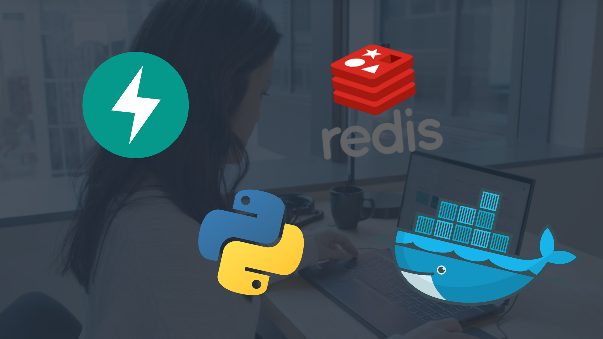
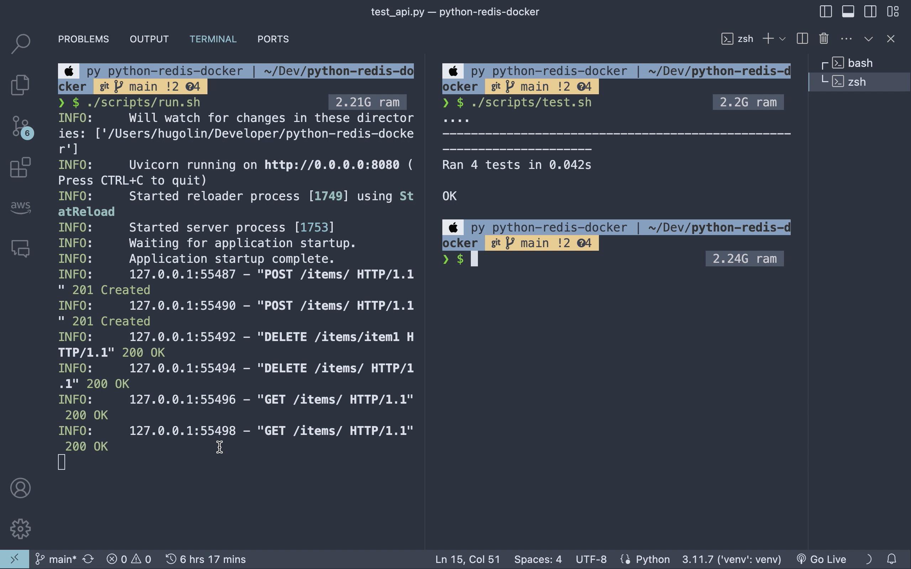

# Python with Redis through Docker



Streamlining the service of FastAPI and Redis through Docker packaging.




## Project Structure

```shell
PROJECT_ROOT
├── app/
│   ├── __init__.py
│   └── main.py
├── scripts/
│   ├── run.sh
│   └── test.sh
├── test/
│   └── test_api.py
├── .env
├── .gitignore
├── docker-compose.yml
├── Dockerfile
├── LICENSE
├── poetry.lock
├── pyproject.toml
├── README.md
└── requirements.txt
```

## Developing Requirements

Python version `python3.11` or later with [`poetry`](https://python-poetry.org/) to manage the dependencies.

> [!IMPORTANT]
> If you have not installed `poetry`, please install it by following the [official guide](https://python-poetry.org/docs/#installation) or you still can use `pip` to install the dependencies.


### Build `venv` for **MacOS**
```shell
$ python3.11 -m venv venv
$ source venv/bin/activate
$ poetry install
# or
$ pip install -r requirements.txt
$ rm -rf venv     # remove the venv
```

### Build `venv` for **Windows**
```shell
$ pip install virtualenv
$ virtualenv venv
$ venv\Scripts\activate
$ poetry install
# or
$ pip install -r requirements.txt
$ rmdir /s venv     # remove the venv
```

### Run web app

Edit the `.env.<YOUR_ENV_TYPE>` file with your own token.

```shell
$ cp .env.dev.example .env.dev
```

```shell
APP_MODE="dev | prod | test"
HOST="localhost"
PORT="8080"
REDIS_HOST="localhost"
REDIS_PORT="6379"
RELOAD="True"
```


### Run the FastAPI server

```shell
./scripts/run.sh
```

### Test the FastAPI server

```shell
./scripts/test.sh
```

## Deployment

with `docker` and `docker-compose` installed, you can build and run the docker image.

### Run the docker container
```shell
# build the docker image and run the container
$ docker-compose up -d
# follow the logs
$ docker-compose logs -f
# stop the container but keep the container
$ docker-compose stop
# stop the container and discard the container
$ docker-compose down
```

> [!WARNING] 
> Since our service separates the server and the database into different containers, we need to pay attention to our `.env` file. We need to set `REDIS_HOST` to redis so that our FastAPI can connect to Redis.

> AWS Educate Cloud Ambassador, Technical Support </br>
> **Hugo ChunHo Lin**
> 
> <aside>
>   📩 E-mail: <a href="mailto:hugo970217@gmail.com">hugo970217@gmail.com</a>
> <br>
>   🧳 Linkedin: <a href="https://www.linkedin.com/in/1chooo/">Hugo ChunHo Lin</a>
> <br>
>   👨🏻‍💻 GitHub: <a href="https://github.com/1chooo">1chooo</a>
>    
> </aside>

## License
Released under [MIT](./LICENSE) by [Hugo ChunHo Lin](https://github.com/1chooo).

This software can be modified and reused without restriction.
The original license must be included with any copies of this software.
If a significant portion of the source code is used, please provide a link back to this repository.
